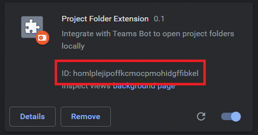

# Teams Bot - Project Folder Extension
Currently, there is no supported way of sharing links to the BC server or ProjectWise server through Microsoft Teams. And as we transition towards this platform and away from standard methods of sharing these links (like e-mail), this pitfall could impede productivity. The system described below solves this problem.

## Demo
Click [here](https://youtu.be/o5GaIPTenus) to see a demo of the interaction.

## Components
The system is composed of five main components which integrate to provide a smooth experience\*.

- **Teams App**: A small package which contains the ID of the Messaging Bot, hosted in Azure, and the interface schema. This is uploaded to Teams by a group admin.
- **.NET Core API**: Exposes the `/api/messages` endpoint which receives requests from the Teams App, processes links and sends back a card for display in Teams with a link to the .NET Core App.
- **.NET Core App**: Sends back static HTML with the `file://` URI to the location of interest.
- **Chrome Extension**: Listens for redirects to `file://` URIs (only on specified domain, e.g. the location of the .NET Core App). Sends the URI to the Native Host.
- **Native Host**: A small executable which can be called by the Chrome Extension. It launches `explorer.exe` with the appropriate path.

\**Due to the security provisions of both MS Teams and Chrome, this is the simplest and cleanest way I could conceive after many attempts at simpler solutions. I discuss some of the challenges more below.*

## Challenges
Many of the challenges faced came from the lack of support of sharing and redirecting to `file://` URIs in both MS Teams and Chrome. My first solution was to use the `openUrl` interface on the Teams card directly, which would theoretically open the file or folder from Teams. However, Teams will censor and transform this value to `https://teams.microsoft.com`. In fact, it will do this for anything besides a properly formatted `https://` or `http://` link.

My next hair-brained idea was to take each request from Teams, assign it a GUID in a database, and serve up some HTML which redirects to this `file://` URI. The link sent back to Teams would be in form `https://serverlinks.azurewebsite.net/link/{GUID}` and send an HTTP 302 redirect to `file://wherever/`. However, upon implementing this, I realized that Chrome as well does not like requests to `file://` URIs from Internet sources and will simply refuse the request. And unfortunately, there is no white list or other provision to this rule.

Finally, I stumbled upon the ability of Chrome extensions to interface with native hosts (i.e. a locally hosted executable). The extension can send and receive information from an arbitrary executable if it's registered in the system (requires a registry entry) and in our case, we can send the path of interest to the executable and launch `explorer.exe` with the path (or ProjectWise, i.e., in the future). What's more, the Chrome extension can be provisioned to only work on certain websites and have access to certain information, allowing for good control over security.

## Next Steps
Some ideas I had that would make this more robust:

- Integrate with ProjectWise
- Convert local paths (e.g. `P:/`) to the user's home UNC so sharing across locations is seamless.

## Installation

### Installing the Teams App
On the [Releases](https://github.com/dnys1/teams-bot/releases) page, you'll find the Teams App package. The Teams App can be installed by following [this guide](https://docs.microsoft.com/en-us/microsoftteams/platform/concepts/deploy-and-publish/apps-upload).

### Installing the Chrome Extension
The Chrome extension can be installed by enabling Developer extensions, clicking "Load Unpacked" on the Extensions page, and pointing to the `chrome_ext` folder in the root of the project. Copy the `ID` that appears in the extension card.

### Installing the Native Host
Installation of the native host is a little cumbersome at the moment, although an installer could be created to automate this. For now, download the zip and unzip it somewhere. Open `open_folder.json` in the unzipped directory, and modify the `allowed_origins` entry to match the `ID` copied in the previous step (e.g. `chrome-extension://{ID}`). Modify the `path` entry to the location of the `open_folder.exe` runtime.

Edit the `add_to_windows_reg.reg` file and modify the location to point to `open_folder.json`. Save it and double-click it to add the key to the registry.

**Installation should be complete now.**